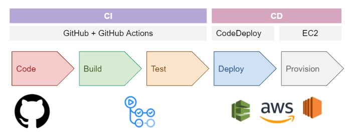
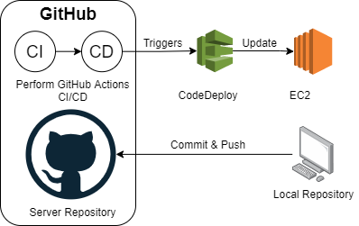

<h1 align='center'>Amazon EC2 Deployment 
  
  
  
</h1> 
<h2 align='center'>CICD Pipeline - GitHub Actions 
   
    
  
  + AWS CodeDeploy
  
  
  
</h2>

CI/CD tools is important to help a team to automate their testing and deployment. Some tools are specifically handle the Continuous Integration (CI) which focusing on build, test and merge the project while some manage the development and deployment (CD) side.
<a href="https://medium.com/thelorry-product-tech-data/amazon-ec2-deployment-complete-ci-cd-pipeline-using-github-actions-and-aws-codedeploy-8a477123ff7e?source=friends_link&sk=9e7f3de840f32925370f65b097db3674">Click here to see the full article/tutorial!</a>

## The CI/CD Stack

CI/CD Tools used in this repository:
- **GitHub Actions** performs the build and test (CI)
- **AWS CodeDeploy:** automates the deployment process to EC2 (CD)

All the project codes are committed in GitHub repository. GitHub Actions will take place once user trigger a push event to the respective repository. It will perform the code build process and run the automated tests. Once it is done, GitHub Actions will run the CD job which will trigger the AWS CodeDeploy to do the deployment part. CodeDeploy will help to automate the deployment by fetching the latest committed code in GitHub and update the project code in the EC2 server.

<a href="https://medium.com/thelorry-product-tech-data/amazon-ec2-deployment-complete-ci-cd-pipeline-using-github-actions-and-aws-codedeploy-8a477123ff7e?source=friends_link&sk=9e7f3de840f32925370f65b097db3674">Click here to see the full article/tutorial!</a>

